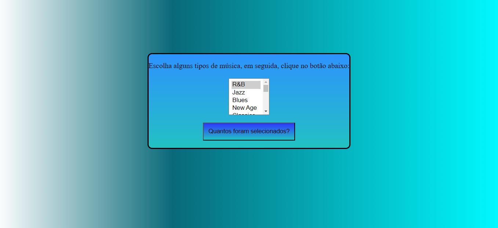

# DECLARAÇÃO 

## HTML
 No html colei e copiei o código que o professor passou para os alunos e pediu para
 os alunos mexer no css e os alunos tinham que criar uma pagina do github com o nome que 
 os alunos fizesse de sua escolha para o html e o css.
## CSS
 No css tive que criar os codigos para mexer na posição do projeto e mudar a cor ponhar borda
 na pagina para que os alunos fizessem de sua escolha para deixar a pagina do jeito que os 
 alunos preferissem.

 
 